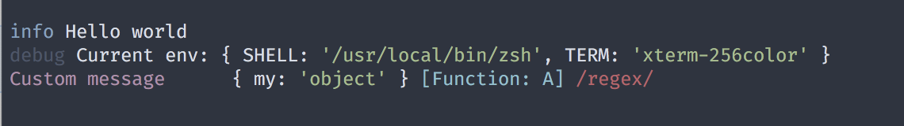
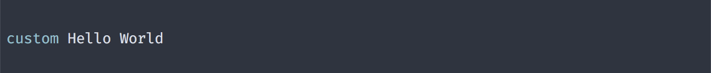
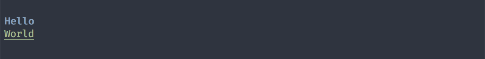

# `cli-tag-logger`

Log messages in CLI apps using tagged template literals.

## Installation & usage

Install the package:
```bash
yarn add https://github.com/zamotany/cli-tag-logger
```

Then:
```js
import * as log from 'cli-tag-logger';

log.print(log.info`Hello world`);
log.print(
  log.debug`Current env: ${{
    SHELL: process.env.SHELL,
    TERM: process.env.TERM,
  }}`
);

log.print(
  log.compose(
    log.styles.magenta`Custom message`,
    ' '.repeat(4),
    { my: 'object' },
    class A {},
    /regex/
  )
);
```

Result:




## API

### Logging

Out of the box `cli-tag-logger` exports the following logging tags:

- `debug`
- `info`
- `success`
- `warn`
- `error`

Additionally use can use:

- `trace` - similar to `console.trace`
- `inspect` - similar to `util.inspect` with some better defaults

By default all logs are written to `process.stdout`. You can override this behavior with `configure` function.

All of the tags returns a strings. You can use provided `print` function, but you can also use `console.log` or anything you want.

If you want to have custom tag, you can use `createTag` function, which accepts `prefix: string` as a first argument and returns a tag function:

```js
import { createTag, styles, print } from 'cli-tag-logger';

const custom = createTag(styles.cyan`custom `);

print(custom`Hello World`);
```



### Styling

`cli-tag-logger` uses [colorette](https://www.npmjs.com/package/colorette) under the hood, and exposes all styling functions like `green`, `bold`, `bgBlue`, `italic` as tags functions with inspect and nesting support:

```js
import { styles } from 'cli-tag-logger';

console.log(styles.blue`${styles.bold`Hello`}`);
console.log(styles.green(styles.underline`World`));
```



### `print` & `configure`

`print` function is used to print values to `process.stdout`. You can pass multiple values:

```js
import { print, debug } from 'cli-tag-logger';

print(debug`Hello`, { a: 1, b: 2 });
```

`configure` allows to override the default behavior of `print` function. You can specify the following properties to configure the behavior:

- `console?: boolean` - set `false` to disable printing to the `process.stdout`
- `file?: string` - pass file name to enable logging to file
- `json?: boolean` - log messages to file in JSON format
- `listener?: (type: 'print', message: string) => void` - custom listener for messages (useful for integrating with other logging solutions eg `winston`)

Logs printed to file will have any styling stripped - no ANSI escape codes will be there.

__Example (logging to file)__:

```js
const { configure, print } from 'cli-tag-logger';

configure({
  file: './messages.log',
});

print('This will be logged in the file');

```


